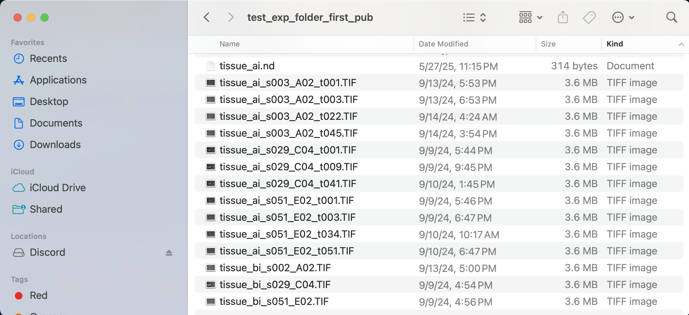
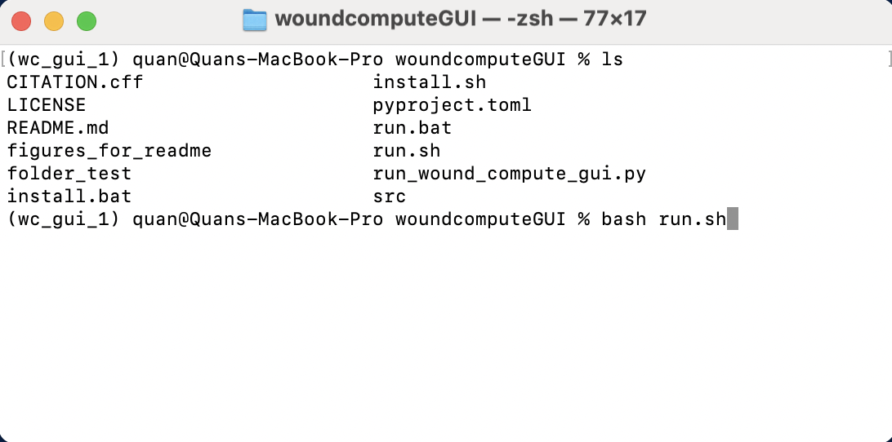
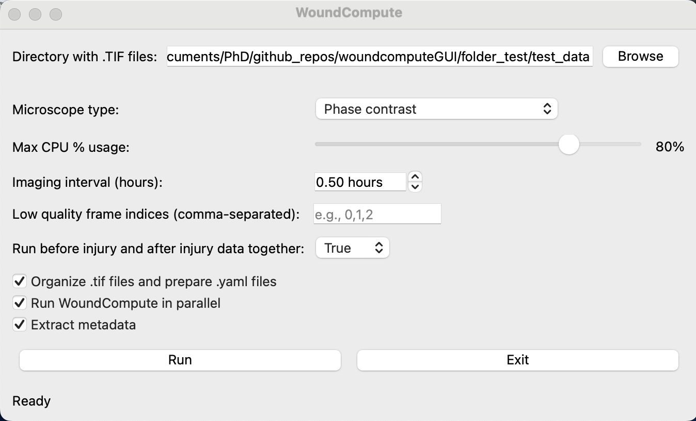
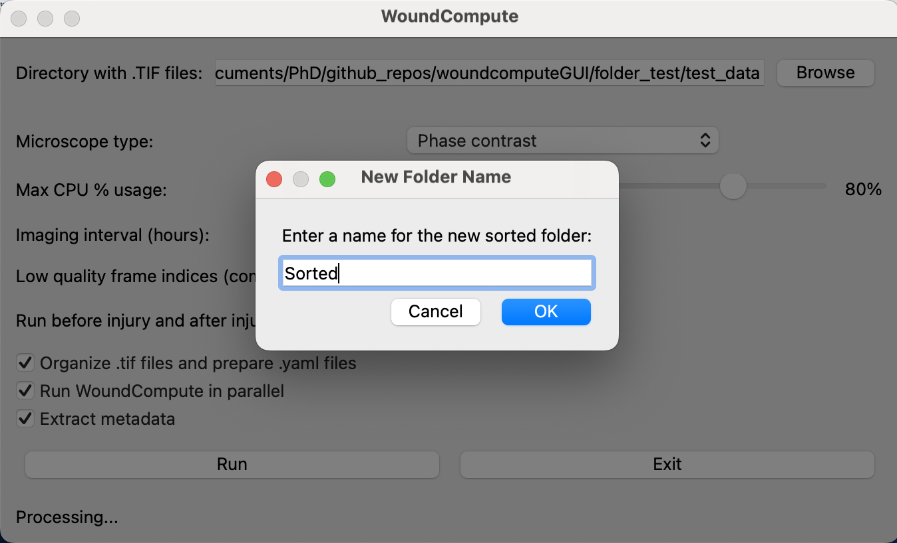
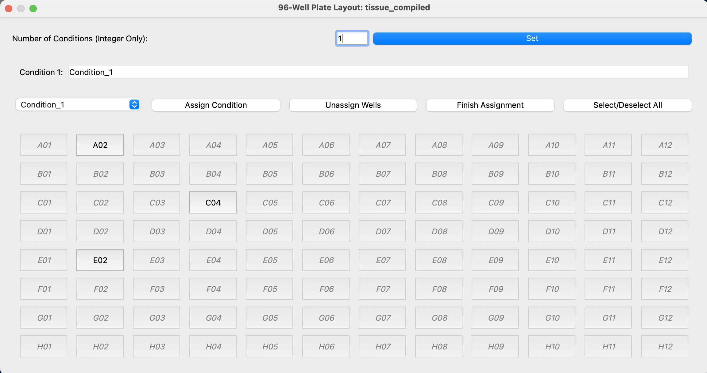
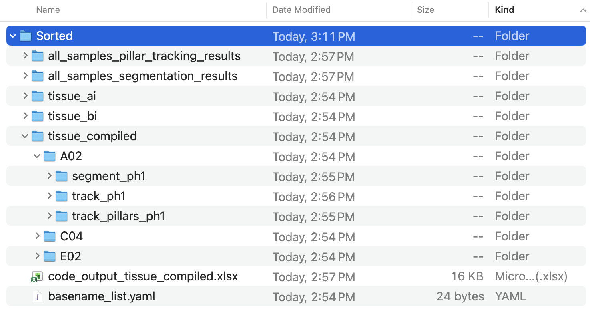

# Wound Compute Graphical User Interface (GUI)

[](https://doi.org/10.5281/zenodo.19896937)


## Table of Contents
* [Package Summary](#summary)
* [Installation Instructions](#install)
* [Data Organization](#organize)
* [Tutorial: Full run from raw data](#tutorialfull)
* [Software Outputs](#outputs)
* [Important Notes](#notes)
* [Contacts](#contacts)

## Package Summary <a name="summary"></a>


This package provides a **Graphical User Interface (GUI)** for **WoundCompute**, making the software easier to use for non-coders. For a full description of WoundCompute, see the [main repository](https://github.com/elejeune11/woundcompute).

This page includes:
- **Installation instructions**
- **A tutorial** on how to run the package

The GUI is designed to simplify interaction with WoundCompute while keeping all its core features.


## Installation Instructions <a name="install"></a>

The repository ships with one-click install and run scripts for **Windows**, **macOS**, and **Linux**. You only need to install **Miniconda** once, and the scripts handle everything else.

### Step 1 — Install Miniconda (one-time)

Download and install Miniconda from [https://docs.conda.io/en/latest/miniconda.html](https://docs.conda.io/en/latest/miniconda.html). Pick the installer that matches your operating system. Use the default options.

After installing, **close and re-open your terminal** (or Command Prompt). On Windows, you can also use the **Anaconda Prompt** shortcut that the installer adds to your Start menu.

### Step 2 — Download the repository

You can either:
- Click the green ``Code`` button on this GitHub page and select ``Download ZIP``, then unzip the ``woundcomputeGUI-main`` folder somewhere convenient, **or**
- If you have ``git``, run: ``git clone https://github.com/quan4444/woundcomputeGUI.git``

### Step 3 — Run the install script

Navigate **into the downloaded folder** and run the installer for your OS.

**Windows**

Double-click ``install.bat``. A window will open showing progress; when it says "Installation complete", you can close it.

**macOS / Linux**

Open a terminal in the downloaded folder and run:
```bash
bash install.sh
```

The script creates a conda environment named ``wound-compute-gui`` and installs everything. Re-running it later is safe — it will reuse the existing environment.

### Step 4 — Launch the GUI

**Windows:** Double-click ``run.bat``.

**macOS / Linux:** In a terminal in the downloaded folder, run:
```bash
bash run.sh
```

The GUI window will open. The first launch may take a few seconds.

### Updating

> *Note: this GUI is fully compatible with WoundCompute v1.0.0. Newer WoundCompute versions might have some compatibility issues. Typically, we will try to keep the GUI compatible with newer versions as is.*

When a new version of WoundCompute (the underlying library) is released, you can pull it into your existing environment by simply re-running the install script:

- **Windows:** double-click ``install.bat`` again.
- **macOS / Linux:** run ``bash install.sh`` again from the repository folder.

The script will detect that the ``wound-compute-gui`` environment already exists, reuse it, and re-fetch the latest WoundCompute from GitHub. Your other installed packages stay untouched.

To update the **GUI itself** (this repository), first refresh your local copy, *then* re-run the install script:

- If you cloned with ``git``: open a terminal in the repository folder and run ``git pull``.
- If you downloaded the ZIP: download the latest ZIP from GitHub, unzip it, and replace the old folder.

Then run ``install.bat`` / ``bash install.sh`` as above.

<details>
<summary><b>Manual installation (for those familiar with CLI)</b></summary>

If the scripts don't work for you, or you prefer to install manually:

1. Install [Miniconda](https://docs.conda.io/en/latest/miniconda.html) and ``git``.
2. Clone or download the repository.
3. Open a terminal in the repository folder and run:
   ```bash
   conda create --name wound-compute-gui python=3.9.13 -y
   conda activate wound-compute-gui
   python -m pip install --upgrade pip setuptools wheel
   python -m pip install -e . --force-reinstall --no-cache-dir
   ```
4. To run the GUI:
   ```bash
   conda activate wound-compute-gui
   python run_wound_compute_gui.py
   ```

</details>

## Data Organization <a name="organize"></a>

Before running Wound Compute, your raw data and the corresponding ``.nd`` file should be organized as below:

<p align = "center">

</p>

In this example, ``tissue_ai_*.TIF`` files are the raw data, with ``tissue_ai_`` as the base name of the experiment, ``s*`` as the sample number, and ``t*`` as the time frame. ``tissue_ai.nd`` is the metadata file for the microscopy. If your data follows the naming convention ``[experiment]_[ai/bi]_[sample number]_[well number]_[time index].TIF``, the code will run fine without a ``.nd`` file. However, we recommend keeping a ``.nd`` file for more precise records of the metadata.

## Tutorial: Full run from raw data <a name="tutorialfull"></a>

Launch the GUI:
- **Windows:** double-click ``run.bat`` in the repository folder.
- **macOS / Linux:** open a terminal in the repository folder and run ``bash run.sh``.

(Users can also activate the conda environment and run ``python run_wound_compute_gui.py`` directly — see the manual-installation section above.)

<p align = "center">

</p>

A window should pop up, where we can select our folder with the raw data and a ``.nd`` file (e.g., test_data in our case). The current ``Microscope Type``s supported are ``Phase contrast`` and ``Differential interference contrast``. We recommend setting ``Max CPU % usage`` to as high as you can so WoundCompute would run and complete faster. The ``Imaging Interval`` is the time between frame when taking pictures of the experiments. ``Low quality frame indices`` are indices of frames that are blurry for the whole experiment. If you have before injury and after injury data, we recommend running them together, so that the output and analysis get stored in the same folder. If running from raw data, we recommend selecting all 3 options available as check boxes:

<p align = "center">

</p>

After selecting ``Run``, another window will pop up and prompt the user to name the output folder. Here, we call that folder ``Sorted``:
<p align = "center">

</p>

After selecting ``OK``, the program will take some time to analyze the data. The run time is dependent upon the size and number of images. At the end of the run, a Well Plate window will pop up:

<p align = "center">

</p>

In this screen, we can select the well(s) in the experiment, and assign conditions to them. Specifically, we can first select the number of conditions, and name the conditions. Then, we can click on the corresponding well, and ``Assign Condition`` to that well. After assigning all conditions to wells, we can select ``Finish Assignment``. This is the final step of the software.

## Software Outputs <a name="outputs"></a>

After processing the data, a folder with your specified name (e.g., Sorted) shows up and contains all the output files. The folder structure looks like:

<p align = "center">

</p>

Here are the descriptions of the output files:
- Folders named with base names. In this example, where ``Run before injury and after injury data together`` was set to ``True``, ``tissue_ai`` and ``tissue_bi`` contain the experimental images for each sample, while``tissue_compiled`` folder contains the WoundCompute analysis data. In each sample folder, there are 2 output subfolders - ``segment_ph1`` with all the analysis data related to tissue and wound segmentation, ``track_pillars_ph1`` with the pillar positions and tracking information. 
- ``all_samples_segmentation_results`` contains wound, tissue, and pillar segmentation for all frames in the same image, for each sample.
- ``all_samples_pillar_tracking_results`` contains pillar tracking results for each sample.
- ``basename_list.yaml`` contains the list of base names corresponding to the name of the experiments.
- ``code_output_*.xlsx`` contains all the analysis information (i.e., wound area, wound closure status, tissue integrity, pillar positions, change in pillar distance from centroid).


## Important Notes <a name="notes"></a>

1. Please try and keep your data with the following naming convention: ``[experiment]_[ai/bi]_[sample number]_[well number]_[time index].TIF``. While alternative naming conventions might work, data following this scheme are guaranteed to work well with WoundComputeGUI.


## Contacts <a name="contacts"></a>

If you run into any issues related to the GUI, please [create an issue on this GitHub](https://github.com/quan4444/woundcomputeGUI/issues) or email quan@bu.edu.