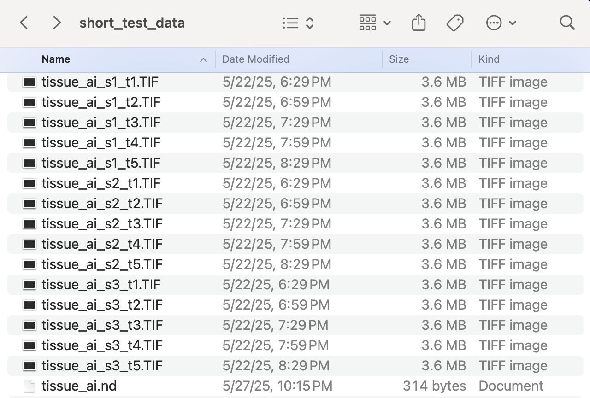
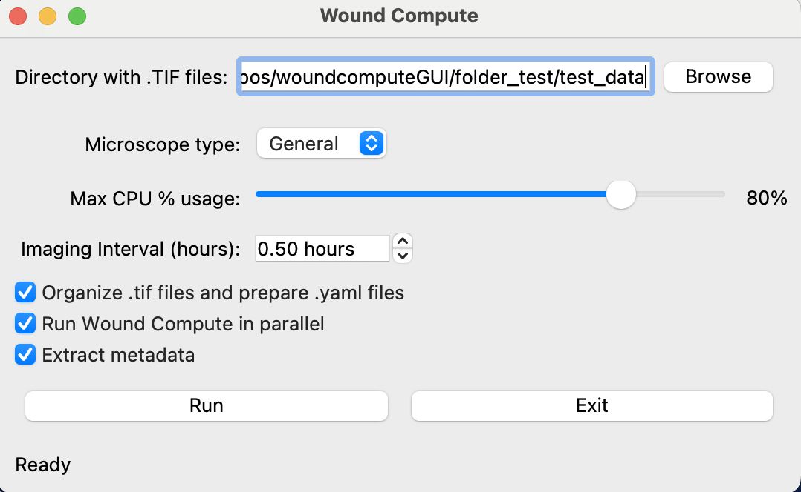
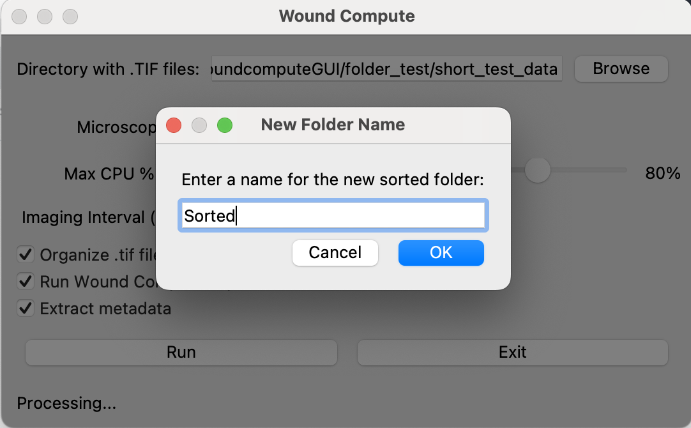
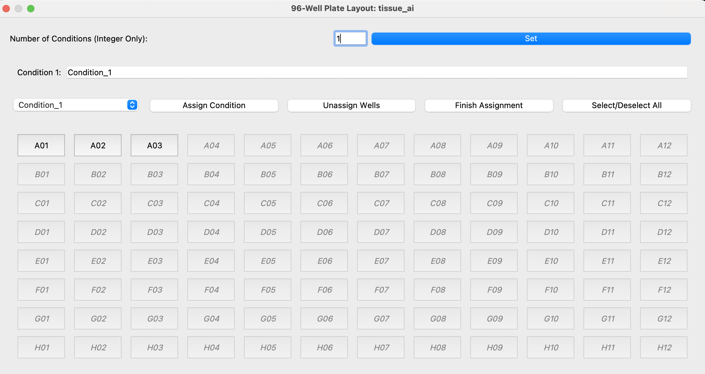

# Wound Compute Graphical User Interface (GUI)


## Table of Contents
* [Package Summary](#summary)
* [Installation Instructions](#install)
* [Data Organization](#organize)
* [Tutorial: Full run from raw data](#tutorialfull)
* [Software Outputs](#outputs)

## Package Summary <a name="summary"></a>


This package provides a **Graphical User Interface (GUI)** for **WoundCompute**, making the software easier to use for non-coders. For a full description of WoundCompute, see the [main repository](https://github.com/elejeune11/woundcompute).

This page includes:
- **Installation instructions**
- **A tutorial** on how to run the package

The GUI is designed to simplify interaction with WoundCompute while keeping all its core features.


## Installation Instructions <a name="install"></a>

### Install git on your system

First, check if you already have git installed by running:
```bash
git --version
```

If a git version pops up, you can skip to the next step "Get a copy of the Wound Compute GUI repository on your local machine". Otherwise, please install git following [this instruction](https://git-scm.com/book/en/v2/Getting-Started-Installing-Git).


### Get a copy of the Wound Compute GUI repository on your local machine

The best way to do this is to create a GitHub account and ``git clone`` the repository. However, you can also download the repository by clicking the ``Code`` button and selecting ``Download ZIP``. Downloaded and unzip the ``woundcomputeGUI-main`` folder and place it in a convenient location on your computer.

### Create and activate a conda virtual environment

1. Install [Anaconda](https://docs.anaconda.com/anaconda/install/) on your local machine.
2. Open a ``Terminal`` session (or equivalent) -- note that Mac computers come with ``Terminal`` pre-installed (type ``⌘-space`` and then search for ``Terminal``).
3. Type in the terminal to create a virtual environment with conda:
```bash
conda create --name wound-compute-gui python=3.9.13
```
4. Type in the terminal to activate your virtual environment:
```bash
conda activate wound-compute-gui
```
5. Check to make sure that the correct version of python is running (should be ``3.9.13``)
```bash
python --version
```
6. Update some base modules (just in case)
```bash
python -m pip install --upgrade pip setuptools wheel
```

Note that once you have created this virtual environment you can ``activate`` and ``deactivate`` it in the future -- it is not necessary to create a new virtual environment each time you want to run this code, you can simply type ``conda activate wound-compute-gui`` and then pick up where you left off (see also: [conda cheat sheet](https://docs.conda.io/projects/conda/en/4.6.0/_downloads/52a95608c49671267e40c689e0bc00ca/conda-cheatsheet.pdf)).

### Install wound compute

1. Use a ``Terminal`` session to navigate to the ``woundcomputeGUI-main`` folder. The command ``cd`` will allow you to do this (see: [terminal cheat sheet](https://terminalcheatsheet.com/))
2. Type the command ``ls`` and make sure that the file ``pyproject.toml`` is in the current directory.
3. Now, create an editable install of wound compute:
```bash
python -m pip install -e .
```
4. If you would like to see what packages this has installed, you can type ``pip list``

## Data Organization <a name="organize"></a>

Before running Wound Compute, your raw data and the corresponding ``.nd`` file should be organized as below:

<p align = "center">

</p>

In this example, ``tissue_ai_*.TIF`` files are the raw data, with ``tissue_ai_`` as the base name of the experiment, ``s*`` as the sample number, and ``t*`` as the time frame. ``tissue_ai.nd`` is the metadata file for the microscopy.

## Tutorial: Full run from raw data <a name="tutorialfull"></a>

To use Wound Compute, first, we activate the Wound Compute GUI environment:
```bash
conda activate wound-compute-gui
```

Before running, let's make sure we're in the correct folder by typing ``ls`` and check for the file ``run_wound_compute_gui.py``. Then, we can start the software with ``python run_wound_compute_gui.py``. In terminal, these commands will look like:

<p align = "center">

</p>

A window should pop up, where we can select our folder with the raw data and a ``.nd`` file (e.g., test_data in our case). The only current ``Microscope Type`` supported is ``General``. The imaging inteval is the time between frame when taking pictures of the experiments. If running from raw data, we recommend selecting all 3 options available as check boxes:

<p align = "center">

</p>

After selecting ``Run``, another window will pop up and prompt the user to name the output folder. Here, we call that folder ``Sorted``:
<p align = "center">

</p>

After selecting ``OK``, the program will take some time to analyze the data. The run time is dependent upon the size and number of images. At the end of the run, a Well Plate window will pop up:

<p align = "center">

</p>

In this screen, we can select the well(s) in the experiment, and assign conditions to them. Specifically, we can first select the number of conditions, and name the conditions. Then, we can click on the corresponding well, and ``Assign Condition`` to that well. After assigning all conditions to wells, we can select ``Finish Assignment``. Here is an example:

<p align = "center">

</p>

This is the final step of the software.

## Software Outputs <a name="outputs"></a>

After processing the data, a folder with your specified name (e.g., Sorted) shows up and contains all the output files. The folder structure looks like:

<p align = "center">

</p>

Here are the descriptions of the output files:
- ``basename_list.yaml`` contains the list of base names corresponding to the name of the experiments.
- ``code_output_*.xlsx`` contains all the analysis information (i.e., wound area, wound closure status, tissue integrity, pillar positions, relative pillar distances, relative pillar distances smoothed by GPR).
- Folders named with base names. In this example, ``tissue_ai`` folder contains the data for each sample in an experiment. In each sample folder, there are 3 subfolders - ``ph1_images`` with all the original images, ``segment_ph1`` with all the analysis data related to tissue and wound segmentation, ``track_pillars_ph1`` with the pillar positions and tracking information. 
- ``visualize_all_samples`` contains all segmented wound images in the same image, for each sample.